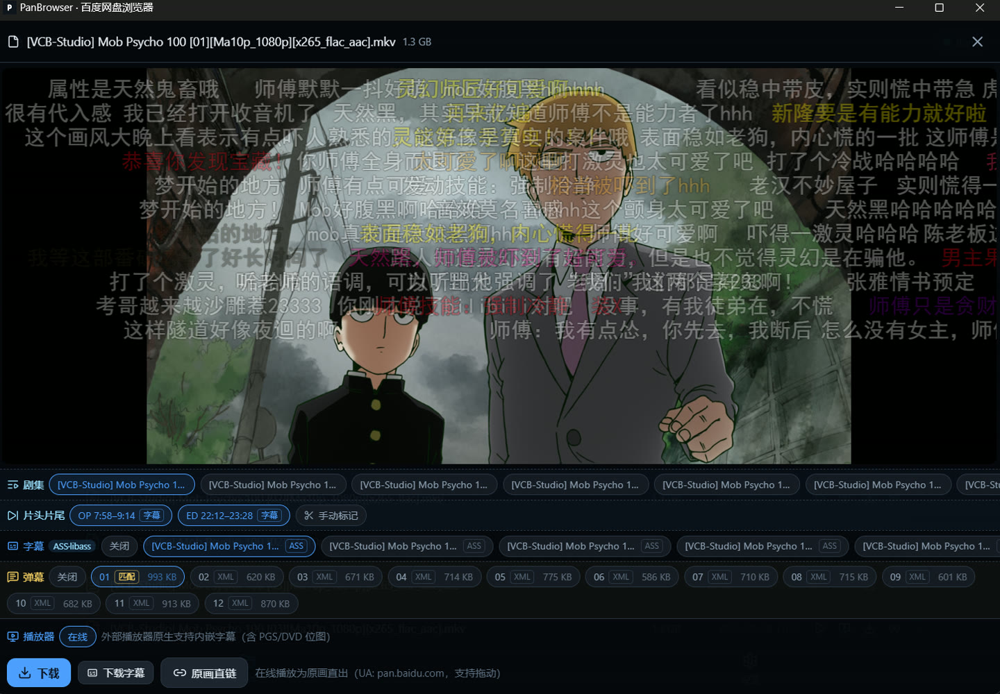
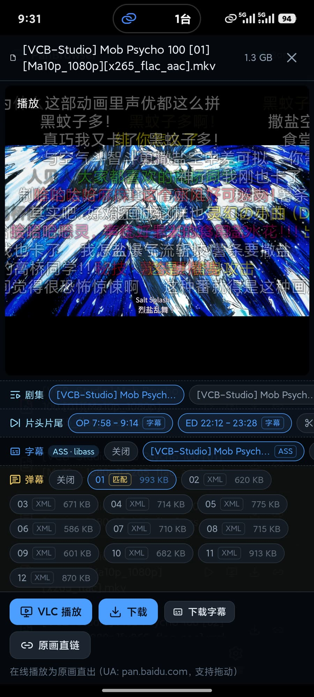

# PanBrowser · 个人百度网盘挂载浏览器（Electron）

## 项目简介

本地自用的桌面应用：Electron + electron-vite + React，只挂载 **百度网盘** 一个存储，
提供类 alist 的文件浏览、**网页内原画在线播放**、字幕（libass 真·ASS 渲染）、弹幕、
跳过片头片尾、观看历史续播，并支持一键拉起 PotPlayer / mpv / VLC 播放原画。

- 所有网盘请求都在**主进程**里发，渲染层只跟本机 HTTP 服务（默认 `127.0.0.1:16888`）说话
- 仓库内**不内置任何账号凭证**（`resources/default-config.json` 被 `.gitignore` 忽略，仅作本机预置）
- 深色主题、无 emoji、lucide 图标、底栏导航，窄屏/手机尺寸自适应

> 另有一套 **Android 离线独立版**（Capacitor + 原生 Kotlin 插件，手机自己跑后端、完全离线），
> 代码在独立目录 `../panbrowser-mobile`，不在本仓库内。

## 截图

播放同一集（《灵能百分百》第 01 集，1080p 原画直出）时的界面，两端**共用同一份渲染层**：
剧集 / 片头片尾 / 字幕 / 弹幕 四条控制栏、ASS 字幕（libass）与弹幕的观感完全一致；
手机版把「下载字幕」等按钮换成触屏尺寸，并多出「VLC 播放」（把原画交给外部播放器）。

### Windows 桌面版



### Android 离线独立版（手机自己跑后端，完全离线）



## 功能

### 挂载与浏览
- 百度网盘开放平台凭证：可从本机 AList 的 `data.db`（driver=`BaiduNetdisk`）只读一键导入，也可手动填写
- 列表翻页（`xpan/file?method=list`）、排序、搜索、面包屑、根目录挂载点（`rootFolderPath`）
- 下载、复制直链（给出带 `User-Agent: pan.baidu.com` 的 `curl` 命令）

### 原画在线播放
- 内置 **ArtPlayer**；播放地址走主进程流代理，请求百度 dlink 时带 `User-Agent: pan.baidu.com`
  （>20MB 文件不加会 403），并**透传 Range** 支持任意拖动
- 断流自愈：`waiting/stalled` 8 秒无进度 → 记住断点 `load()` 重连（最多 3 次）
- 浏览器解不了的编码（H.265/HEVC、AC3 等）一键交给外部播放器（PotPlayer / mpv / VLC）

### 字幕
- 自动发现视频同目录字幕（srt / ass / ssa / vtt）并**内容嗅探真实格式**（扩展名不符也能正确分流）
- ASS/SSA → **libass-wasm(SubtitlesOctopus)** 独立 canvas 按 ASS 规范渲染：坐标、颜色、边框、
  字体、特效全还原 —— 即 PotPlayer 观感
- VTT/SRT → 服务端转 WebVTT 走播放器原生轨道；SRT 还可按配置转成带描边的 ASS
- **字幕粗细**：`常规`（默认，严格按字幕文件自身的 Bold 设定，不加粗）/ `中等` / `加粗`
- **全局字幕字体**：设置页可选字体文件；ASS 里指定而系统缺失的字体自动回退到它
- 字幕可单条切换、单独下载

### 弹幕
- **同目录 B 站 XML 优先**：自动匹配与视频同名的 `.xml`，可切换任意一份
- **弹弹play 文件识别兜底**：同目录没有 xml 时点「加载弹幕」→ 拉候选（按相关度排序）→ 手动选一集
  → 立即加载并**缓存映射与 xml**，之后自动加载
- 弹幕渲染交给 `artplayer-plugin-danmuku`（开关、透明度、字号、速度、显示区域可在播放器内设置）
- 设置页有**弹幕缓存管理**（文件数/总大小/缓存目录、最近文件列表、清空）

### 跳过片头片尾（OP/ED）
- 三层信号自动定位（手动标记 > 章节打标 > 字幕信号），进度条染色 + 右下角浮出「跳过 OP」按钮
- 可在设置里开自动跳过、设延迟秒数；结果按文件缓存，手动标记优先级最高
- 仅对内置网页播放器生效，外部播放器不受影响

### 观看历史
- 记住每个视频上次播放位置，下次打开自动续播（服务端 `userData/watch-history.json`，
  桌面 / `npm run dev` / 局域网访问共用同一份进度）

## 技术细节

### 进程与目录
```
src/main/       主进程：本机 HTTP 服务、百度 API、字幕转换、字体、跳过检测、弹弹play
  server.js       所有 /api/* 路由（渲染层唯一入口）
  api/baidu.js    百度网盘客户端（令牌/列表/dlink/搜索，带内存缓存）
  subtitles.js    字幕嗅探/解码/SRT→ASS/按粗细改 Bold
  fonts.js        全局字幕字体解析（配置 > 环境变量 > 系统候选）
  skip.js         片头片尾三层信号检测（章节 ffprobe + 字幕样式/重复文本）
  dandanplay.js   弹弹play 签名认证、文件识别、候选打分、JSON→B站XML、缓存
  history.js      观看历史
src/renderer/   渲染层：React + zustand + ArtPlayer + libass-wasm
  lib/api.js      渲染层唯一的 API 入口（dev 时指向 16888，prod 同源）
resources/      打包进安装包的静态资源（vendor/libass、示例配置）
out/            构建产物（electron-vite 输出，会打进安装包）
```

### 百度网盘开放接口（对齐 AList 官方驱动）
| 用途 | 请求 |
| --- | --- |
| 刷新令牌 | `GET openapi.baidu.com/oauth/2.0/token?grant_type=refresh_token&...` |
| 列表 | `GET pan.baidu.com/rest/2.0/xpan/file?method=list&dir=...&start=0&limit=200` |
| 取直链 | `GET pan.baidu.com/rest/2.0/xpan/multimedia?method=filemetas&fsids=[id]&dlink=1` |
| 流/下载 | `dlink&access_token=...` → 带 `User-Agent: pan.baidu.com` 跟随重定向后按 Range 流式传输 |
| 账户 | `GET pan.baidu.com/rest/2.0/xpan/nas?method=uinfo` |

### 本机服务与流代理
- 主进程内置 HTTP 服务（默认 `127.0.0.1:16888`；端口被占用时自动顺延）。设置页可改 `0.0.0.0` 供局域网访问
- 流代理要点：上游 `error/aborted/未读完就关闭` 立即结束客户端响应（避免 `<video>` 无限等待）；
  30s 只用于「建连+响应头」，流式阶段用软看门狗；上游 401/403/404/410/416/5xx 刷新 dlink 重试一次
- 诊断日志：主进程写项目根目录 `.debug/log.txt`，渲染层关键事件经 `/api/debug/log` 写同一文件

### 字幕渲染
- 服务端把任意外挂/内嵌字幕统一转成增强 ASS（白字 + 描边），`/api/subass` 交给 libass
- `subtitles-octopus` 的 worker/wasm 由本机服务托管（`/vendor/libass/*`），字体由 `/vendor/fonts/*` 提供
- 浏览器看不到系统字体，所以字体**必须**显式登记（`availableFonts` + `fallbackFont`），见 `fonts.js`

### 弹幕
- 同目录 XML：服务端列目录（`/api/fs/subs` 返回 `danmakus`）+ `/api/danmaku` 代理取回原始 XML
- 弹弹play：`POST /api/v2/match`（文件名/占位 hash/大小）→ 候选；`GET /api/v2/comment/{episodeId}?withRelated=true`
  返回 **JSON**，服务端转成 **B 站 XML** 再交给播放器
- 认证用**签名模式**：`X-Signature = base64(sha256(AppId + Timestamp + Path + AppSecret))`
- 缓存：`userData/danmaku/*.xml` + 索引（含 episodeId、条数），路径 `/api/danmaku/cache`
- **AppSecret 不明文落地**：配置文件里存混淆值（`obf1:…`，`config.js` 里 XOR+base64），运行时解码；
  `/api/status` 只回「是否已配置」，不回传密钥

### 跳过 OP/ED 的信号优先级
| 优先级 | 数据源 | 手段 |
| --- | --- | --- |
| 1 | 手动标记 | 播放器内以当前位置打点，可只作用本集或整个剧集 |
| 2 | 章节（打标） | `ffprobe -show_chapters`；先按名字识别 `OP/NCOP/Opening/ED/NCED/Ending/Intro/Preview`，无名字时按「60~130s 独立章节 + 位置」推断 |
| 3 | 字幕 | ASS 样式名（`OPJP/EDCN`…）聚成歌词块 + 外挂字幕跨集重复文本；内嵌字幕复用播放器已抽取的结果（零额外带宽） |

结果按文件缓存（`userData/skip-cache.json`），手动标记存 `userData/skip-marks.json`。

### 打包
- `npm run dist` → electron-builder 出 **NSIS 安装包**（`dist/PanBrowser Setup x.y.z.exe`）
- 便携版：把 `dist/win-unpacked` 打成 zip 即可

## 开发 / 运行

```bash
npm install
npm run dev     # 开发模式（渲染层热更新；改了主进程要重启）
npm run build   # 构建到 out/
npm start       # 预览构建产物
npm run dist    # 打包 Windows 安装包
```

首次启动为**未登录**状态。两种配置方式：

1. 应用设置页 →「从 AList 导入凭证」填入本机 AList 数据目录（含 `data.db`）→ 扫描 → 导入；
   或手动填写开放平台 `client_id / client_secret / refresh_token`
2. 无图形界面时预置：把 `resources/default-config.example.json` 复制为
   `resources/default-config.json` 并填好字段（该文件已被 `.gitignore` 忽略）
   - 弹弹play 的凭证填 `ddpAppId` + `ddpAppSecretEnc`（用 `obf1:` 混淆值；明文 `ddpAppSecret` 也兼容，但会被自动转成混淆值存回）

> 百度 `refresh_token` 是一次性令牌（刷新会轮换）。与正在运行的 AList 共用同一令牌时，AList 刷新会消耗它；
> 遇到 `refresh token has been used` 时，在 AList 里重新保存一次该存储（持久化最新令牌），或停止 AList 后再导入。
> 应用内置容错：持有有效 `access_token` 时不主动刷新，只有接口返回 401 才刷新。

## 第三方与相关链接

本项目的核心能力建立在下面这些第三方服务与开源项目之上，感谢它们。

### 服务 / 数据源

| 名称 | 链接 | 用途 |
| --- | --- | --- |
| 百度网盘 | https://pan.baidu.com/ | 文件存储（本项目只挂载这一家） |
| 百度网盘开放平台 | https://pan.baidu.com/union | 列表 / dlink / 账户接口 |
| 弹弹play | https://www.dandanplay.com/ | 弹幕数据来源（文件识别匹配） |
| 弹弹play 开放弹幕网络 · 文档 | https://doc.dandanplay.com/open/ | 接口说明、签名验证模式 |
| 弹弹play 开发者中心 | https://dev.dandanplay.com/ | 申请 AppId / AppSecret |

### 开源依赖

| 名称 | 链接 | 用途 |
| --- | --- | --- |
| Electron | https://www.electronjs.org/ | 桌面运行时 |
| electron-vite | https://electron-vite.org/ | 构建与开发服务器 |
| React | https://react.dev/ | 渲染层界面 |
| Vite | https://vite.dev/ | 渲染层构建 |
| zustand | https://github.com/pmndrs/zustand | 渲染层状态管理 |
| ArtPlayer | https://artplayer.org/ | 网页播放器 |
| artplayer-plugin-danmuku | https://www.npmjs.com/package/artplayer-plugin-danmuku | 弹幕渲染（吃 B 站 XML，`p` 需 8 段） |
| JavascriptSubtitlesOctopus (libass-wasm) | https://github.com/libass/JavascriptSubtitlesOctopus | 真·ASS 字幕渲染（还原坐标/特效） |
| FFmpeg | https://ffmpeg.org/ | 内嵌字幕抽取、章节探测（需自备，见设置页） |
| lucide | https://lucide.dev/ | 图标 |
| Capacitor | https://capacitorjs.com/ | 手机离线独立版（独立目录 `../panbrowser-mobile`） |
| NanoHTTPD | https://github.com/NanoHttpd/nanohttpd | 手机版本机流代理（Range + UA 转发） |

### 相关项目 / 参考

| 名称 | 链接 | 说明 |
| --- | --- | --- |
| AList | https://github.com/AlistGo/alist · https://alistgo.com/ | 百度驱动接口对齐参考；凭证可一键从它的 `data.db` 导入 |
| VLC | https://www.videolan.org/vlc/ | 外部播放器（桌面/手机都用） |
| PotPlayer | https://potplayer.tv/ | 外部播放器（Windows） |
| mpv | https://mpv.io/ | 外部播放器 |

## 免责声明

仅供个人学习与交流。所有文件版权归权利人所有；本项目不存储任何文件，仅作百度网盘官方接口的个人客户端封装，
接口随百度调整可能失效。弹幕数据来自弹弹play 开放弹幕网络。（此项目以及该README.md由AI辅助生成，请谨慎甄别信息真假）

> 嵌入式 Chromium 解码能力有限 —— H.265/HEVC、AC3 等编码无法在网页播放器解码（浏览器限制，与字幕无关），
> 此类原画建议用「PotPlayer 播放」。数 GB 级原画流播放时 Chromium 进程 CPU 占用较高，属环境行为。
